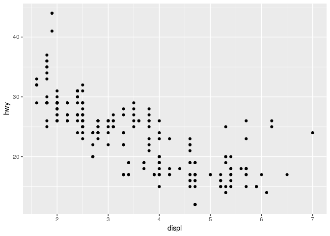

Homework 2: ggplot
================
2019-03-08

``` r
library(tidyverse)
```

    ## ── Attaching packages ──────────────────────────────────────────────────────────── tidyverse 1.2.1 ──

    ## ✔ ggplot2 3.1.0       ✔ purrr   0.3.1  
    ## ✔ tibble  2.0.1       ✔ dplyr   0.8.0.1
    ## ✔ tidyr   0.8.3       ✔ stringr 1.4.0  
    ## ✔ readr   1.3.1       ✔ forcats 0.4.0

    ## ── Conflicts ─────────────────────────────────────────────────────────────── tidyverse_conflicts() ──
    ## ✖ dplyr::filter() masks stats::filter()
    ## ✖ dplyr::lag()    masks stats::lag()

  - Take the first faceted plot in this section:

<!-- end list -->

``` r
ggplot(data = mpg) + 
  geom_point(mapping = aes(x = displ, y = hwy)) + 
  facet_wrap(~ class, nrow = 2)
```

<!-- -->

What are the advantages to using faceting instead of the colour
aesthetic? What are the disadvantages? How might the balance change if
you had a larger dataset?

MS: variable per category can be seen separately and it is easy to
analyze (especially the amount) as the values do not overlap;

by overlapping variable values, in some cases, it is easier to compare
them;

with the larger dataset the analysis without faveting will be more
complicated as more values will be together

  - Recreate the R code necessary to generate the following
graphs.

<!-- end list -->

``` r
knitr::include_graphics(paste0("plots/fig", 1:6, ".png"))
```


``` r
ggplot(data = mpg, mapping = aes(x = displ, y = hwy)) + 
  geom_point() + 
  geom_smooth(se = FALSE)
```

    ## `geom_smooth()` using method = 'loess' and formula 'y ~ x'

<!-- -->

``` r
ggplot(data = mpg, mapping = aes(x = displ, y = hwy)) + 
  geom_point() + 
  geom_smooth(mapping = aes (group = drv), se = FALSE)
```

    ## `geom_smooth()` using method = 'loess' and formula 'y ~ x'

<!-- -->

``` r
ggplot(data = mpg, mapping = aes(x = displ, y = hwy, color = drv)) + 
  geom_point() + 
  geom_smooth(mapping = aes (group = drv), se = FALSE)
```

    ## `geom_smooth()` using method = 'loess' and formula 'y ~ x'

<!-- -->

``` r
ggplot(data = mpg, mapping = aes(x = displ, y = hwy)) + 
  geom_point(mapping = aes (color = drv)) + 
  geom_smooth(se = FALSE)
```

    ## `geom_smooth()` using method = 'loess' and formula 'y ~ x'

<!-- -->

``` r
ggplot(data = mpg, mapping = aes(x = displ, y = hwy)) + 
  geom_point(mapping = aes (color = drv)) + 
  geom_smooth(mapping = aes (linetype = drv), se = FALSE)
```

    ## `geom_smooth()` using method = 'loess' and formula 'y ~ x'

<!-- -->

``` r
ggplot(data = mpg, mapping = aes(x = displ, y = hwy, colour = drv)) + 
  geom_point(stroke = 1, colour = "white") + 
  geom_point(size = 1)
```

<!-- -->

  - Most geoms and stats come in pairs that are almost always used in
    concert. Read through the documentation and make a list of all the
    pairs. What do they have in common?

MS:

| geom                | stat                |
| ------------------- | ------------------- |
| `geom_bar()`        | `stat_count()`      |
| `geom_bin2d()`      | `stat_bin_2d()`     |
| `geom_boxplot()`    | `stat_boxplot()`    |
| `geom_contour()`    | `stat_contour()`    |
| `geom_count()`      | `stat_sum()`        |
| `geom_density()`    | `stat_density()`    |
| `geom_density_2d()` | `stat_density_2d()` |
| `geom_hex()`        | `stat_hex()`        |
| `geom_freqpoly()`   | `stat_bin()`        |
| `geom_histogram()`  | `stat_bin()`        |
| `geom_qq_line()`    | `stat_qq_line()`    |
| `geom_qq()`         | `stat_qq()`         |
| `geom_quantile()`   | `stat_quantile()`   |
| `geom_smooth()`     | `stat_smooth()`     |
| `geom_violin()`     | `stat_violin()`     |
| `geom_sf()`         | `stat_sf()`         |

Complementary geoms and stats

  - Compare and contrast geom\_jitter() with geom\_count().

MS: Geom\_jitter - The jitter geom is a convenient shortcut for
geom\_point(position = “jitter”). It adds a small amount of random
variation to the location of each point, and is a useful way of handling
overplotting caused by discreteness in smaller datasets.

Geom\_count - This is a variant geom\_point() that counts the number of
observations at each location, then maps the count to point area. It
useful when you have discrete data and overplotting.

``` r
ggplot(data = mpg, mapping = aes(x = displ, y = hwy)) + 
  geom_point()
```

<!-- -->

``` r
ggplot(data = mpg, mapping = aes(x = displ, y = hwy)) + 
  geom_jitter()
```

<!-- -->

``` r
ggplot(data = mpg, mapping = aes(x = displ, y = hwy)) + 
  geom_count()
```

<!-- -->

  - What does the plot below tell you about the relationship between
    city and highway mpg (fuel consumption)? Why is coord\_fixed()
    important? What does geom\_abline() do?

<!-- end list -->

``` r
ggplot(data = mpg, mapping = aes(x = cty, y = hwy)) +
  geom_point() + 
  geom_abline() +
  coord_fixed()
```

<!-- -->

MS: The consumption of fuel on the hwy and city is linear - cars
consuming more fuel on the hwy, consume more fuel in the cty and visa
versa.

Abline - These geoms add reference lines (sometimes called rules) to a
plot, either horizontal, vertical, or diagonal (specified by slope and
intercept). These are useful for annotating plots.

Coord\_fixed - A fixed scale coordinate system forces a specified ratio
between the physical representation of data units on the axes. The ratio
represents the number of units on the y-axis equivalent to one unit on
the x-axis. The default, ratio = 1, ensures that one unit on the x-axis
is the same length as one unit on the y-axis. Ratios higher than one
make units on the y axis longer than units on the x-axis, and vice
versa. This is similar to MASS::eqscplot(), but it works for all types
of graphics.

Coord-fixed is important for fixing the x- and y-axis into teh same
units.

  - What is the default geom associated with stat\_summary()? MS:
    pointrange

<!-- end list -->

``` r
ggplot(data = diamonds) + 
  stat_summary(
    mapping = aes(x = cut, y = depth),
    fun.ymin = min,
    fun.ymax = max,
    fun.y = median
  )
```

<!-- -->

How could you rewrite the previous plot to use that geom function
instead of the stat function?

``` r
ggplot(data = diamonds) + 
  geom_pointrange(mapping = aes(x= cut, y=depth, ymin = depth, ymax = depth))
```

<!-- -->

  - What does geom\_col() do? How is it different to geom\_bar()? MS:
    There are two types of bar charts: geom\_bar() and geom\_col().
    geom\_bar() makes the height of the bar proportional to the number
    of cases in each group (or if the weight aesthetic is supplied, the
    sum of the weights). If you want the heights of the bars to
    represent values in the data, use geom\_col() instead. geom\_bar()
    uses stat\_count() by default: it counts the number of cases at each
    x position. geom\_col() uses stat\_identity(): it leaves the data as
    is.

geom\_bar - bar size is the proportional value of the sum geom\_col -
each bar represents the value, in other words - bars are infront of each
other

  - What variables does stat\_smooth() compute? What parameters control
    its behaviour?

MS: Computed variables y - predicted value ymin - lower pointwise
confidence interval around the mean ymax - upper pointwise confidence
interval around the mean se - standard error

Respective arguments control the behaviour.

  - In our proportion bar chart, we need to set group = 1. Why? In other
    words what is the problem with these two graphs?

<!-- end list -->

``` r
ggplot(data = diamonds) + 
  geom_bar(mapping = aes(x = cut, y = ..prop..))
```

<!-- -->

``` r
ggplot(data = diamonds) + 
  geom_bar(mapping = aes(x = cut, y = ..prop.., fill = color))
```

<!-- -->

``` r
ggplot(data = diamonds) + 
  geom_bar(mapping = aes(x = cut, y = ..prop.., group = 1))
```

<!-- -->

``` r
ggplot(data = diamonds) + 
  geom_bar(mapping = aes(x = cut, y= ..prop.., fill = color, group = 1
                         )) 
```

<!-- --> MS: I can not
figure out why adding “Fill= color and group= 1” did work to devide bars
by colors?

Without group = 1, R assumes that each x value is a group and the
proporsion is 100%.
